  

  
  
  

## 👋 Hola, soy Estuardo

Diseñador gráfico **e** ingeniero en sistemas — la mezcla rara que hace que un producto se vea bien **y** funcione bien.
Co-fundador de **Kaiden, S.A.**, donde construimos software a medida, e-commerce y sitios web para empresas en Guatemala.

- 🎨 Del boceto en Figma al componente en producción, sin que se pierda el diseño en el camino
- ⚛️ Front-end con **React + Vite**, interfaces rápidas y con detalle
- 🐍 Back-end con **Django**, desplegado en **Docker**
- 🇬🇹 Trabajando desde Xela para clientes de todo el país

## 🧰 Con lo que trabajo

**Front-end**

  
  
  
  
  

**Back-end e infraestructura**

  
  
  
  
  
  

**Diseño**

  
  
  
  

## 🚀 Kaiden, S.A.

Estudio de desarrollo y diseño en Quetzaltenango. Lo que hacemos:

| | |
|---|---|
| 💻 **Software a medida** | Sistemas hechos a la forma de trabajar de cada empresa |
| 🛒 **E-commerce** | Tiendas en línea listas para vender, no solo para verse |
| 🎨 **Diseño gráfico y de marca** | Identidad, piezas para redes y material impreso |
| 🌐 **Web y hosting** | Sitios, dominios, correo corporativo y mantenimiento |
| 🧭 **Consultoría** | Acompañamiento técnico para digitalizar procesos |

  

## 📊 GitHub

  
  

## 📬 Hablemos

¿Tienes una idea, un sistema que se quedó a medias o una marca que necesita verse mejor? Escríbeme.

  
  

Hecho desde Quetzaltenango, Guatemala 🇬🇹

